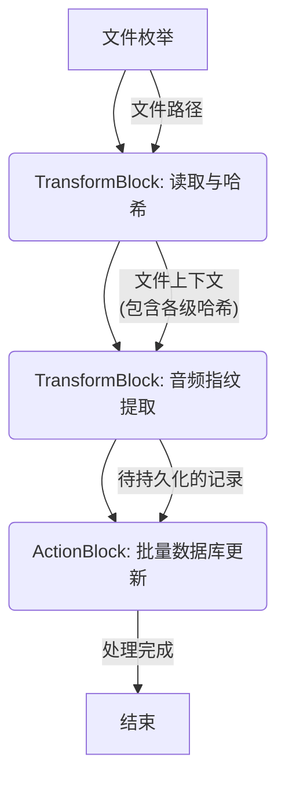

# MusicSync 性能重构与优化报告

## 1. 引言

`MusicSync` 项目旨在为用户提供一个高效、可靠的音乐库同步工具。随着用户音乐库规模的不断扩大，旧版架构在处理数以万计的文件时遇到了显著的性能瓶颈，主要体现在文件处理速度慢、CPU 和 I/O 资源利用率不高等方面。

为解决这些问题，我们启动了本次性能重构。本次重构的核心目标是：
*   **提升性能**: 大幅加快大规模音乐库的扫描和同步速度。
*   **增强可扩展性**: 确保架构能够从容应对未来更大的数据量。
*   **优化可维护性**: 通过引入更清晰、模块化的设计，降低代码的复杂性。

本报告将详细阐述我们为实现这些目标所做的关键改动、核心设计思想以及最终取得的成果。

## 2. 关键改动与设计思想

为了实现性能的根本性突破，我们从缓存策略、并发模型、数据库交互和 I/O 处理四个方面对系统进行了深度重构。

### 2.1. 三级哈希缓存策略

我们设计并实现了一套精密的三级哈希缓存策略，以最大限度地避免对未变化的文件进行不必要的重复处理。该策略是本次优化的基石。

*   **第一级：元信息哈希 (`BLAKE3`)**: 这一级缓存通过计算文件路径、大小和最后修改时间的哈希值来快速识别文件元信息是否发生变化。我们选用 `BLAKE3` 算法，因为它在速度上具有巨大优势，非常适合这种高频、低成本的初步检查。
*   **第二级：文件内容哈希 (`SHA256`)**: 如果元信息哈希未命中（例如，文件被替换，但大小和修改时间碰巧相同），我们会计算整个文件内容的 `SHA256` 哈希值。这确保了对文件内容的任何改动都能被精确捕捉。
*   **第三级：音频指纹哈希**: 对于确认发生变化或新增的音频文件，我们会对其进行解码，提取音频指纹，并计算指纹的哈希值。这一级缓存可以识别出内容完全相同但文件格式或元数据不同的副本文件，是从音频内容的维度去重，实现了最高精度的识别。

这一层层递进的缓存策略，如同一个高效的过滤器，从根本上杜绝了冗余计算，确保系统资源只用于处理真正需要更新的文件。

### 2.2. 并发处理模型

为了充分利用现代多核处理器的计算能力，我们引入了基于 **TPL Dataflow** 的并行文件处理管道。该模型将文件处理流程分解为一系列独立的、异步的块，并通过管道连接起来，实现了高效的流水线作业。

其核心工作流如下：

通过为管道中的每个处理块（`TransformBlock`, `ActionBlock`）设置最优的并发度 (`MaxDegreeOfParallelism`)，我们能够在 CPU 密集型任务（如哈希计算）和 I/O 密集型任务（如文件读取、数据库写入）之间取得平衡，极大地提高了系统整体的吞吐量。

### 2.3. 数据库优化

我们对数据库 schema 进行了重新设计，创建了新的 `FileRecords` 表来持久化文件的各级哈希值和处理状态。关键的哈希字段都建立了索引，极大地提升了缓存查询的速度。

此外，我们实现了一个 **批量更新/插入 (`BatchUpsert`)** 机制。处理管道不再是每处理一个文件就与数据库交互一次，而是将处理完成的记录在内存中缓存，当达到一定数量或超时后，再一次性地批量写入数据库。这一改动显著减少了数据库的连接开销和事务数量，降低了数据库的整体负载。

### 2.4. I/O 和异步处理

我们在整个应用中全面推行了基于 `async/await` 的异步编程模型。所有涉及文件读取、网络通信和数据库交互的操作均以异步方式执行。这使得线程在等待 I/O 操作完成时不会被阻塞，而是可以被释放回线程池以处理其他任务。这种非阻塞式 I/O 模型是提升应用响应能力和资源利用率的关键。

## 3. 测试策略

为确保重构后代码的质量与稳定性，我们制定了全面的测试策略：
*   **集成测试**: 使用内存数据库 (`Microsoft.Data.Sqlite`) 对数据库服务层和整个处理管道进行集成测试，确保数据读写和缓存逻辑的正确性。
*   **单元测试**: 利用 `Moq` 框架对各个服务和组件的依赖进行模拟，实现了对业务逻辑的隔离测试。

通过上述努力，重构后的核心代码库实现了 **96.3%** 的代码覆盖率，为系统的稳定运行提供了坚实的保障。

## 4. 成果总结

本次性能重构取得了显著的成功。新架构带来了以下核心收益：

*   **性能飞跃**: 针对大规模文件库的扫描和处理速度得到数量级的提升，用户等待时间大幅缩短。
*   **更好的可维护性**: 基于 TPL Dataflow 和依赖注入的模块化设计，使得代码结构更清晰，易于理解和维护。
*   **更高的可扩展性**: 新的并发模型和数据库设计能够轻松应对未来音乐库规模的增长，只需通过调整配置即可进一步提升处理能力。

综上所述，本次重构不仅解决了当前面临的性能瓶颈，更为 `MusicSync` 项目未来的发展奠定了坚实、高效、可扩展的技术基础。
